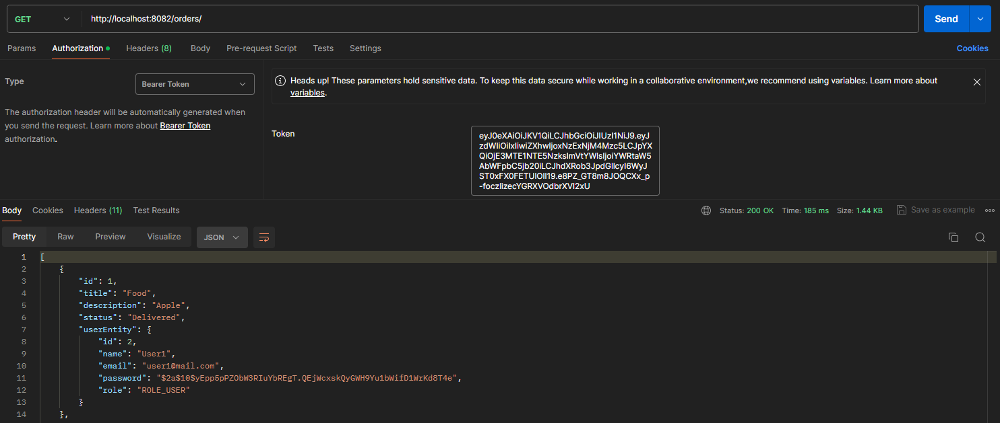

# Spring_AOP Application

The Spring_AOP application is a system designed for Spring Security 
with JWT token and AOP using Log4j2. It consists of a Postgres database, 
Spring Boot 3.1.4 services with unit tests for aspects,
and configurations for Docker-based development environments. 

The application was scheduled to automatically register two users 
with orders and admin in database with Hibernate.

## Getting Started
To get started with the Spring_AOP application, follow these steps:
1. Clone this repository to your local machine.
2. Run `docker-compose up` to start Spring Boot services with database.
3. Access the logging-application service via the provided endpoint.

## Project Structure
The project is structured as follows:
- `logging-application`: Contains the Spring Boot application with Spring Security and Aspects.
- `docker-compose.yml`: Defines the Docker Compose configuration for setting up the services and database.

## Running the Application
To run the Logging-Application application, execute the following command in the project root directory:
    ```bash
    docker-compose up -d

When containers are running, you may with token from logs:
1. The logging-application endpoints at:
   1. http://localhost:8082/orders
   2. http://localhost:8082/users
   3. http://localhost:8082/auth (no need of token)

Example of get request with token in Postman:


##  Swagger UI
To run Swagger UI, go to following path:
- `logging-application`: http://localhost:8082/swagger-ui/index.html